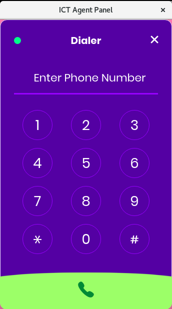
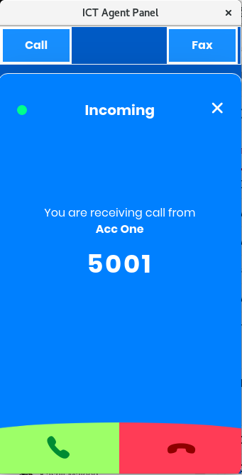
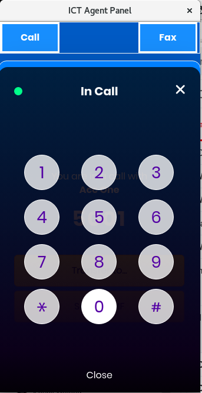
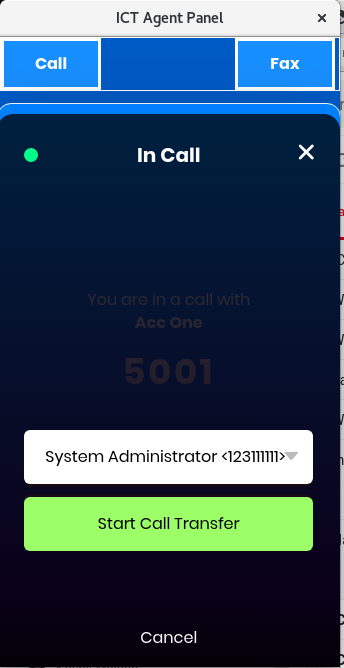
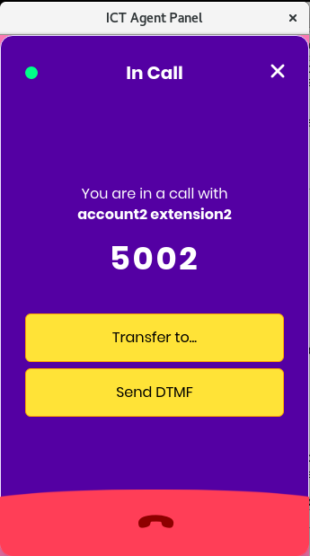

User Guide for ICT Agent(Browser Extension)
==========================================

This extension will embed WebRTC based VoIP Phone in browser which will remain connected to the main server, and will be responsible for inbound and outbound calls, transfer calls as well as sending DTMF. It is easy to use and will save a lot of agent time in searching for the desired data.

### Features
- An Embedded Web Phone.
- It is OS Portable, we just need a browser.
- Click 2 Call
- Agent can access contents, contacts and communications from a single application(browser).
- It can harvest contacts from random pages / websites/ web applications.
- CRM Integration
- Inbound and Outbound Calls
- Call Transfer
- Send DTMF

### Install the Extension
- Open the [Chrome Web Store](https://chrome.google.com/webstore).
- Search for the **ICT Agent** Extension in the google web store.
- Click **Add to Chrome**.
- A box will open that lists the data that the extension will be able to access.
- Click **Add Extension** to grant the extension access to your data and install the extension.
- Extension will be installed.

- To use the extension click the icon to the right of address bar in chrome.

### Extension Settings
Once the extension is successfully installed, update the extension settings for this:
- Right click on the extension icon.
- A menu will appear like **Search Phone numbers**, **Options**.
- Click **Options**.
- It will redirect you to the Settings page.

- **Authentication**

  Enter the Url, Username and Password. If all of these fields are valid then a success message will appear.
  If an error message displays then again fill the required fields with correct credentials.
  
- **Select Extension**  

  Click Reload to reload the Accounts / Extensions.
  Select the Extension.
  Now all inbound and outbound calls will be handled through this Extension.
  
- **Contact Load Url**
  
  Enter the Contact Load Url i.e the URL of the Customer Relationship management(CRM), so that when the call is connected it will load the particular contact details.
  
- **Enter Regular Expression**

  Enter Phone Regular Expression to match the Phone pattern on the webpage.
  
- **Search Phone on new Tab**

  If you want to search phone number automatically on the new tab, then select the Checkbox.
  
- **Autoload Widget Popup**
  
  If you want to auto load the popup window, upon clicking the phone number then select the checkbox.

### Search Phone number
You can search Phone numbers by Enabling the Search Phone checkbox in the **Options** page.

If you want to manually search the phone number on the desired page then you can simply achieve by following these steps:

* Right click the Extension icon.
* Click **Search Phone Numbers**
* It will highlight all the numbres on the page and will make all the numbers clickable.

### Open the Web Phone / Popup

- To open the web phone click on the extension icon, it will open the Web Phone Window.
- Right click the extension icon it will open the **Phone / Popup** Window.

### Make a Call

- To Call the specific number open the **Popup / Phone** Window.
- Enter the number in the input field.
- Click the **Call** button.

### Click 2 Call

To enable Click 2 Call, enable the auto load popup checkbox. Search Phone number and by clicking any number Phone window will automatically open and will forward the call to the number clicked. OR If the checkbox is not disabled, you can still use this feature by manually opening the Phone window through extension icon in chrome and by clicking the number it will forward call to the number clicked.

### Answer an inbound Call

To answer an inbound Call the **Phone / Popup** must be open. On incoming call it will show the Caller name and accept and reject button. To answer the Call Click the **Accept** button and if you want to reject the Call then click the **Reject** button.

### Send DTMF

During surveys and polls when the caller asks you to press the specific key you can use send DTMF buttons to send your response.
When the Call is connected, a screen will display like this having the option of sending DTMF, Click the button you want to send as DTMF.

### Transfer Call

When the call is connected you can also forward it to another agent, a dropdown or a list of agent will appear, select the agent and the call will be connected to that particular agent.

### Load the particular Contact

To load the particular contact enter the CRM url in the **Options** page which will redirect you to the partciular contact when the call is connected. Click the number and it will load the particular contact details.

