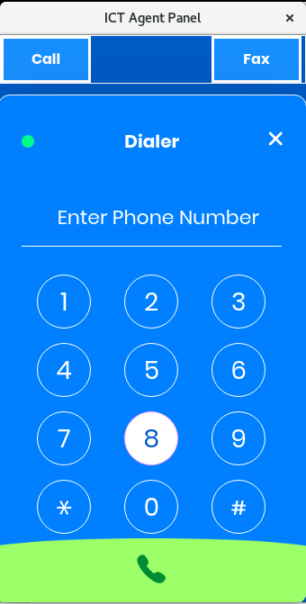

User Guide for ICT Agent(Browser Extension)
==========================================

This extension will embed WebRTC based VoIP Phone in browser which will remain connected to the main server, and will be responsible for inbound and outbound calls, transfer calls as well as sending DTMF. It is easy to use and will save a lot of agent time in searching for the desired data.

Features
--------
- An Embedded Web Phone.
- It is OS Portable, we just need a browser.
- Click 2 Call
- Agent can access contents, contacts and communications from a single application(browser).
- It can harvest contacts from random pages / websites/ web applications.
- CRM Integration
- Inbound and Outbound Calls
- Call Transfer
- Send DTMF

Install the Extension
---------------------
- Open the [Chrome Web Store](https://chrome.google.com/webstore).
- Search for the **ICT Agent** Extension in the google web store.
- Click **Add to Chrome**.
- A box will open that lists the data that the extension will be able to access.
- Click **Add Extension** to grant the extension access to your data and install the extension.
- Extension will be installed.

- To use the extension click the icon to the right of address bar in chrome.

Extension Settings
------------------
Once the extension is successfully installed, update the extension settings for this:
- Right click on the extension icon.
- A menu will appear like **Search Phone numbers**, **Options**.
- Click **Options**.
- It will redirect you to the Settings page.

### Authentication

  Enter the Url of communication server i.e Api Url, Username and Password. If all of these fields are valid then a success message will appear.
  If an error message displays then again fill the required fields with correct credentials.
  
### Select Extension  
  If there no extensions in the dropdown than click the Refresh button it will load the extensions.
  Select the Extension.
  Now all inbound and outbound calls will be handled through this Extension.
  
### Enter URL to load information of incoming and outgoing caller
  
  Enter the Contact Load Url i.e the URL of the Customer Relationship management(CRM), so that when the call is connected it will load the particular contact details.
  
### Pattern to search phone number in web pages

  Enter Phone Regular Expression to match the Phone pattern on the webpage. So that when you search the phone number it will scan the whole web page and will find the numbers that match the phone pattern given as input and will convert all that numbers into the link.
  
### Search Phone on new web page

  If you want to search/scan phone number automatically on the web page, then select the Checkbox.
  
### Automatically open the Phone widget when user click on phone number
  
  If you want to auto load the popup window, upon clicking the phone number then enable the checkbox.

Scan Phone number
-----------------
You can scan/search Phone numbers by Enabling the **Search Phone on the new web page checkbox** in the **Options** page.

If you want to manually search the phone number on the desired page then you can simply achieve by following these steps:

* Right click the Extension icon.
* Click **Search Phone Number in current Tab**
* It will highlight all the numbres on the page and will make all the numbers clickable.

Open the Web Phone / Popup
--------------------------
- To open the web phone click on the extension icon, it will open the Web Phone Window.
- Enable the checkbox **Automatically open the Phone widget** in options/settings page it will automatically open the Popup window when the number is clicked.

Make a Call
-----------
- To Call the specific number open the **Popup / Phone** Window.
- Enter the number in the input field.
- Click the **Call** button.

Click 2 Call
------------
To enable Click 2 Call, enable the auto load popup checkbox. Search Phone number and by clicking any number in the web page Phone window will automatically open and will forward the call to the number clicked. OR If the checkbox is not enabled, you can still use this feature by manually opening the Phone window through extension icon in chrome and by clicking the number it will forward call to the number clicked.

Answer an inbound Call
----------------------
To answer an inbound Call the **Phone / Popup** must be open. On incoming call it will show the Caller name and accept and reject button. To answer the Call Click the **Accept** button and if you want to reject the Call then click the **Reject** button.

You can also open the caller details by clicking the number on the incoming call screen.

Send DTMF or Transfer
--------------------
When the call is connected, it has the options to both send DTMF or Transfer Call.

### Send DTMF

During surveys and polls when the caller asks you to press the specific key you can use send DTMF buttons to send your response.
When the Call is connected, click the send DTMF button, it will open the keypad, click the button in keypad you want to send as DTMF.

### Transfer Call

When the call is connected simply click the Transfer to button, a dropdown or a list of agent will appear, select the agent and click the start transfer call and the call will be connected to the agent/extension selected.

Load the Contact Information
--------------------------
To load the Contact information enter the CRM url in the **Options** page which will load the partciular contact when the call is either connecting or connected. Click the number and it will load the particular contact details.

During Outgoing, incoming and incall click the number label and it will load the particular contact details.

