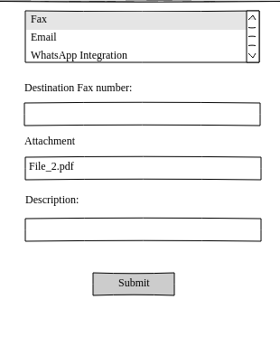

## ICT Agent(Browser Extension)

This extension will embed WebRTC based VoIP Phone in browser which will remain connected to the main server, and will be responsible for inbound and outbound calls, transfer calls, sending DTMF, sending Fax, sending sms and sending message to whatsapp as well. It can harvest contacts from the random pages. Agent can access contents, contacts from a single application. Browser can automatically fetch required URL depending on the course of call. Automatic URL will eliminate any delay which agent take while searching and finding desired data.

User can click on any number on the webpage and this will present the user with 4 options i.e either they want to connect with them through

1. Call
2. SMS
3. Fax
4. WhatsApp.

It can be integrated with any of the existing CRM.

### Features of ICT Agent(Browser Extension)

- An Embedded Web Phone.
- It is Operating System Independent, we just need a browser.
- Click 2 Call, SMS, Fax, WhatsApp.
- Agent can access contents, contacts and communications from a single application(browser).
- It will make agent performance much better.
- It can harvest contacts from random pages / websites/ web applications.
- CRM Integration.
- Inbound and Outbound Calls.
- Call Transfer.
- Send DTMF.
- Load contact information of incoming and outgoing caller
- Search for the desired Phone pattern
- Authentication
- Agent Login/Logoff

### How it works?

There will be two menus shown to the user One is the Call Menu and other is the Dialer Menu

#### Call Menu

Through call menu an interactive webphone will be shown to the user and user can make calls through phone, receive calls through phone, transfer calls as well as send DTMF.

##### Make A Call

It would present a simple web phone to the user with the two menu Call menu and Dialer menu. When user click on the Call menu the following screen will be displayed

  

 

Through this user can make the call to the specified numer.

##### Receive a Call

Whenever there is incoming call for the user the following screen will be shown to the user:

  

 

User has both options either to answer the call or reject it.

##### Send DTMF

When call is connected it will display the screen. 

  

 

User can click on the **Send DTMF** button and following screen will be shown to the user:

  

 

Here user has the option to send DTMF.

##### Transfer the call

When call is connected it will display the screen. 

  

 

User can click on the **Transfer Call** button and following screen will be shown to the user:

  

 

Here it will display the list of the existing extensions. User can transfer the call to the specified extension

#### Dialer Menu

Here the Dialer menu will be shown to the user. The Dialer menu will have the following screen.

  

 
Here when user click on anyother option from menu the specified screen will be shown.
